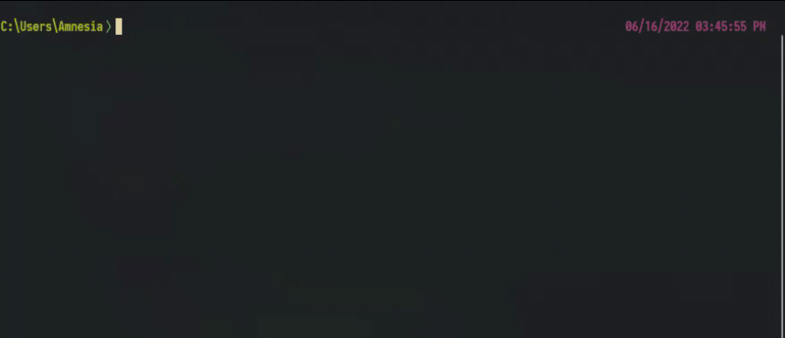

# nu-tabline

A Vim inspired tabline for [Nushell](https://github.com/nushell/nushell) to keep track of your subshells.



## Basic setup

 - Clone this repo or copy `tabline.nu` somewhere in your configs.
 - Add an import near the top of your config: `use path/to/tabline.nu`
 - Somewhere near the end of your config call: `tabline init`

That's it.   
Although you'll probably want to customize it a bit, so read on.

## Configuration

You can customize looks through the environment variable `tabline`.
Example:

```shell
let-env tabline = { 
    separator_hard: "" 
    separator_soft: ""
    inactive_foreground: "#C0FFEE"
    active_background: "#541514"
}

tabline init
```

The available options and their default values:

```shell
let-env tabline = { 
    # Symbols that separate segments. Note that the default ones requires a Nerdfont
    separator_hard: ""
    separator_soft: ""
    
    # Colors used for inactive segments
    inactive_foreground: '#0d5f99' 
    inactive_background: '#111111'

    # Colors used for active segments
    active_foreground: '#ffffff'
    active_background: '#0d5f99'

    # Whether or not add a separator after the last tab
    end_separator: false
}
```

Additionally the module exposes a few functions that can be used in keybindings

- `tabline switch <tab>`: switch to the (zero-indexed) tab
- `tabline close`: close the current tab
- `tabline clear`: clear the screen without wiping the tabline.

Example configuration:

```shell
use tabline
def tabmap [key:int] {
    let event = {
        send: executehostcommand
        cmd: $"tabline switch ($key - 1)"
    }
    {
        name: $"tab($key)"
        modifier: alt
        keycode: $"char_($key)"
        mode: [emacs vi_normal]
        event: $event
    }
}
let keybindings = [
    (tabmap 1)
    (tabmap 2)
    (tabmap 3)
    (tabmap 4)
    (tabmap 5)
    {
        name: close_tab
        modifier: alt
        keycode: char_q
        mode: [emacs vi_normal] 
        event: { send: executehostcommand cmd: 'tabline close' }
    }
    {
        name: close_tab
        modifier: ctrl
        keycode: char_l
        mode: [emacs vi_normal] 
        event: { send: executehostcommand cmd: 'tabline clear' }
    }
]